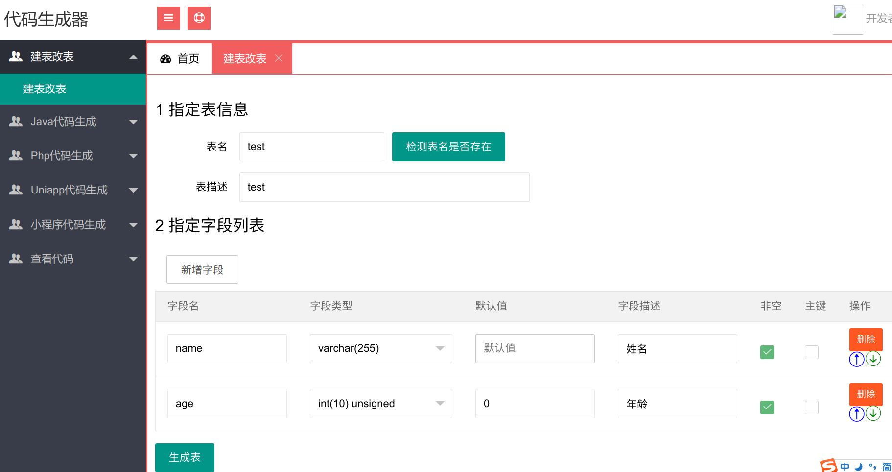
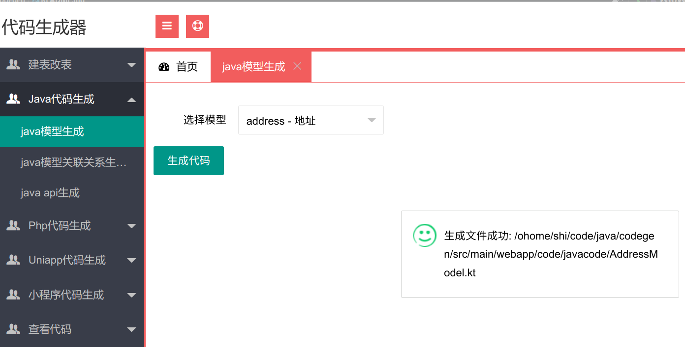
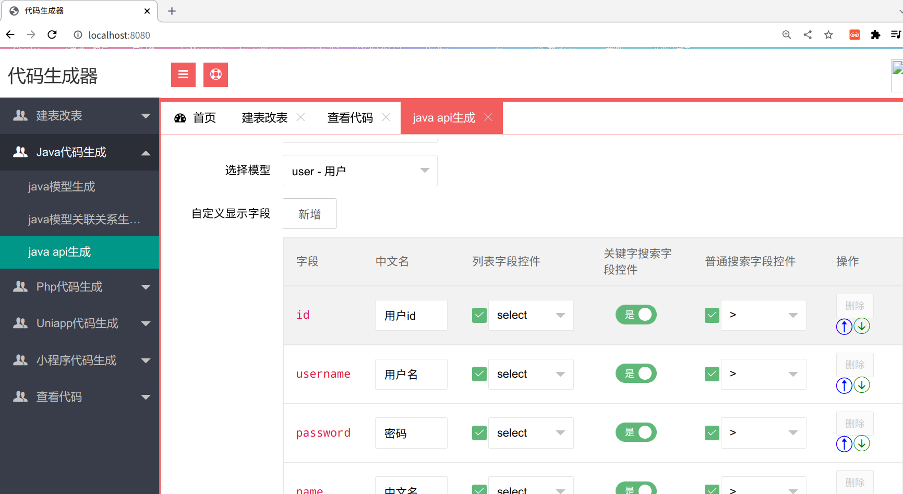
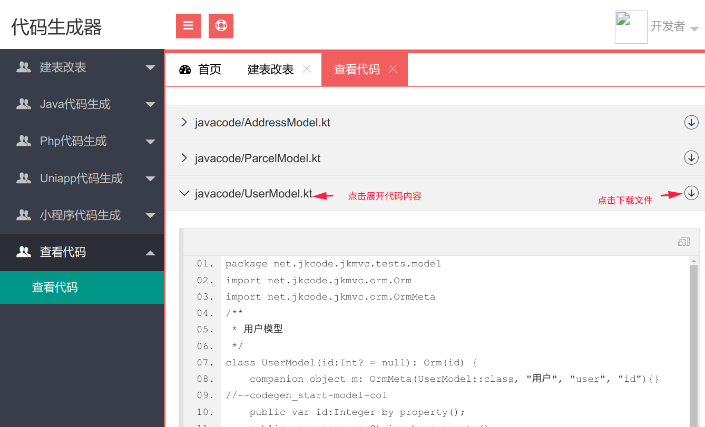

[GitHub](https://github.com/shigebeyond/codegen) | [Gitee](https://gitee.com/shigebeyond/codegen) 

基于 [jkmvc](https://github.com/shigebeyond/jkmvc) + jphp 实现的的代码生成器，主要用来生成 java项目、php项目、uniapp项目、小程序项目等mvc代码。

目前只开源了 java代码生成, 至于 php、uniapp、小程序后续有空再开源。

- 注: 依赖最新的jkmvc框架

## 1 建表

## 2 java(kotlin)模型类生成

## 3 java(kotlin) api控制器类生成

## 4 查看生成的代码
